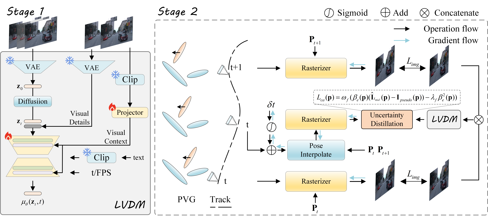

## VDEGaussian

Official implementation of "VDEGaussian: Video Diffusion Enhanced 4D Gaussian Splatting for Dynamic Urban Scenes Modeling".

### [Project](https://pulangk97.github.io/VDEGaussian-Project/) | [Paper](https://www.arxiv.org/pdf/2508.02129)

### Pipeline

### Installation
#### Environments

```
# Make a conda environment.
conda create --name vdegaussian python=3.9
conda activate vdegaussian

# Install requirements.
pip install -r requirements.txt

# Install simple-knn
git clone https://gitlab.inria.fr/bkerbl/simple-knn.git
pip install ./simple-knn

# a modified gaussian splatting (for feature rendering)
git clone --recursive https://github.com/SuLvXiangXin/diff-gaussian-rasterization
pip install ./diff-gaussian-rasterization

# Install nvdiffrast (for Envlight)
git clone https://github.com/NVlabs/nvdiffrast
pip install ./nvdiffrast

## Install requirements for DynamiCrafter
pip install -r requirements_dc.txt


```
#### Download Checkpoints

1. Download the checkpoint of DynamiCrafter for [Interpolation](https://huggingface.co/Doubiiu/DynamiCrafter_512_Interp/blob/main/model.ckpt). 
2. Put `model.ckpt` into `./checkpoints/dynamicrafter_512_interp_v1/`.
3. Download `open_clip_pytorch_model.bin` and put it into `./submodules/DynamiCrafter/pretrained/`.
### Datasets
#### Waymo Open Datasets
1. Download raw scenes used in original paper (segment id: `102319, 103913, 106250, 109636, 121618, and 225932`) from [Waymo](https://waymo.com/open/).
2. Process the raw scenes following [PVG](https://github.com/fudan-zvg/PVG).
3. Put the processed scenes into `./data/waymo_scenes`.


### Getting Start

#### Stage 1 (Test Time Adaptation)
```
bash scene_train.sh
```

#### Stage 2 (4DGS Training)

```
bash pvg_train.sh
```

### Citation
This project is heavily borrowed from [PVG](https://github.com/fudan-zvg/PVG) and [DynamiCrafter](https://github.com/Doubiiu/DynamiCrafter)
```
@article{chen2023periodic,
  title={Periodic Vibration Gaussian: Dynamic Urban Scene Reconstruction and Real-time Rendering},
  author={Chen, Yurui and Gu, Chun and Jiang, Junzhe and Zhu, Xiatian and Zhang, Li},
  journal={arXiv:2311.18561},
  year={2023},
}
```
```
@article{xing2023dynamicrafter,
  title={DynamiCrafter: Animating Open-domain Images with Video Diffusion Priors},
  author={Xing, Jinbo and Xia, Menghan and Zhang, Yong and Chen, Haoxin and Yu, Wangbo and Liu, Hanyuan and Wang, Xintao and Wong, Tien-Tsin and Shan, Ying},
  journal={arXiv preprint arXiv:2310.12190},
  year={2023}
}
```
If you find our work useful, please cite:
```
@misc{xiao2025vdegaussianvideodiffusionenhanced,
      title={VDEGaussian: Video Diffusion Enhanced 4D Gaussian Splatting for Dynamic Urban Scenes Modeling}, 
      author={Yuru Xiao and Zihan Lin and Chao Lu and Deming Zhai and Kui Jiang and Wenbo Zhao and Wei Zhang and Junjun Jiang and Huanran Wang and Xianming Liu},
      year={2025},
      eprint={2508.02129},
      archivePrefix={arXiv},
      primaryClass={cs.CV},
      url={https://arxiv.org/abs/2508.02129}, 
}
```